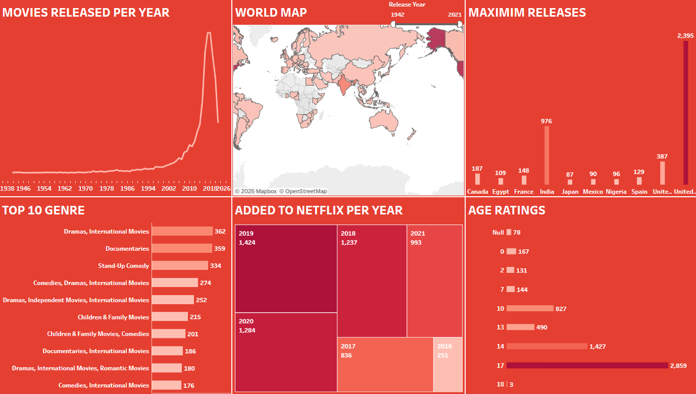

# 📺 Netflix Dashboard – Tableau

This repository contains a Tableau dashboard that analyzes Netflix data, visualizing trends in content, genres, ratings, and release years.

---

## 📊 View the Dashboard

You can download the `.twbx` file and open it in **[Tableau Public](https://public.tableau.com/en-us/s/download)** (free).

**Download file:**  
[Netflix.twbx](Netflix.twbx)

---

## 🖼 Dashboard Preview

---

## 📂 Repository Contents
- **Netflix.twbx** → Tableau packaged workbook containing the dashboard.
- **screenshot.png** → Image preview of the dashboard.

---

## 🚀 How to Use
1. **Download** the `Netflix.twbx` file.
2. **Install** [Tableau Public](https://public.tableau.com/en-us/s/download) (if not already installed).
3. **Open** the file in Tableau to explore the interactive dashboard.

---

## 📢 Notes
- Data sources and visuals are for educational purposes only.
- For live interactive view, you can also publish this dashboard directly to Tableau Public.

---

## 👨‍💻 Author
Created by **[Your Name]**
